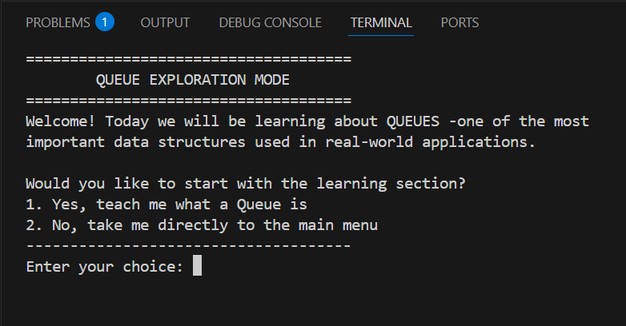
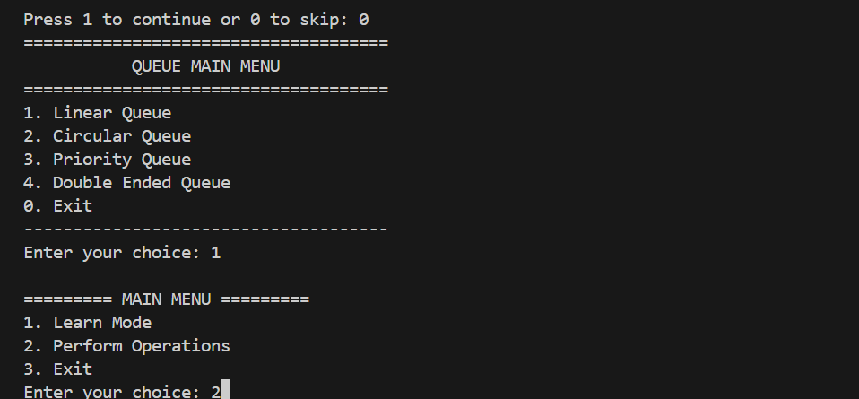
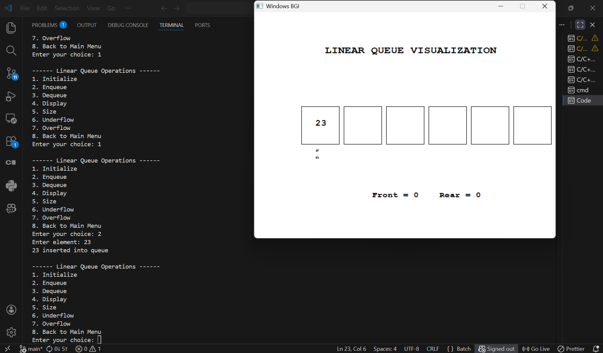
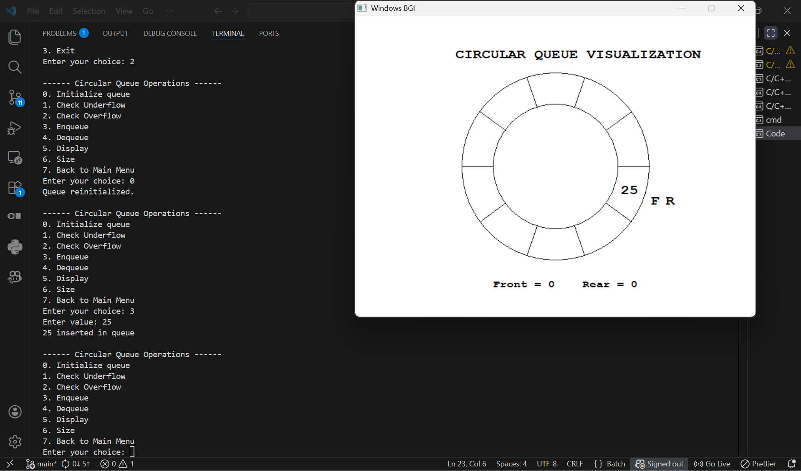
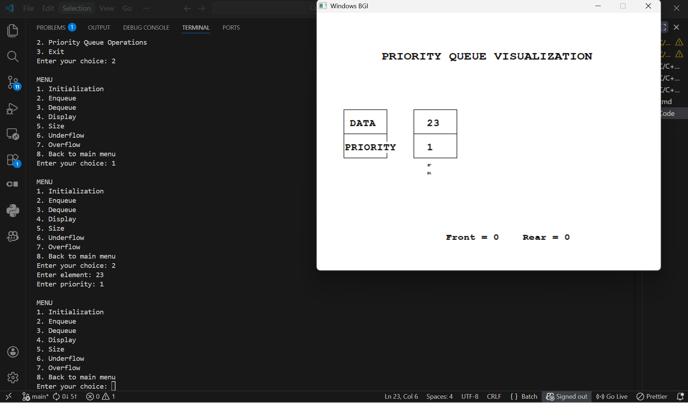
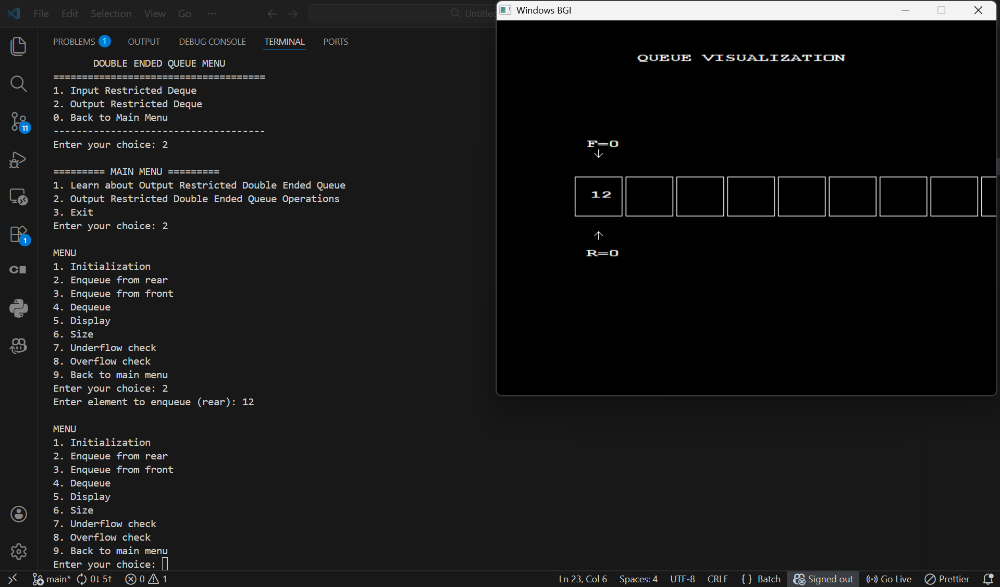

# GraphiQueue

GraphiQueue is a **visual learning project** that demonstrates multiple **Queue Data Structures using C++ graphics**.
It combines **console explanations** with **graphical visualization** to make learning queue operations easier and more interactive.

This project is especially useful for **Data Structures students and beginners**.

---

# Supported Queue Types

The program demonstrates the following queue structures:

* Linear Queue
* Circular Queue
* Priority Queue
* Double Ended Queue (Deque)

  * Input Restricted Deque
  * Output Restricted Deque

Each queue type includes:

* **Learn Mode** – explains the concept
* **Operation Mode** – performs queue operations with graphical visualization

---

# Program Features

## Learn Mode

Each queue contains a **text-based explanation section** that introduces:

* What the queue structure is
* Terminologies like **Front**, **Rear**, and **Priority**
* Queue operations such as **Enqueue** and **Dequeue**
* Real-world applications of queues

This section runs in the **console**.

---

## Graphics Mode

Queue operations are visualized using **WinBGIm graphics (`graphics.h`)**.

Visualization includes:

* Boxes representing queue elements
* Arrows indicating **Front** and **Rear**
* Live updates during enqueue and dequeue
* Custom layouts for different queue types

Special visualizations include:

* Circular layout for **Circular Queue**
* Priority-based display for **Priority Queue**
* Two-ended operations for **Deque**

---

# Demo

## Program Start Screen



The program begins with a console introduction explaining queue concepts.

---

## Main Queue Menu



Users can select which queue type they want to explore.

---

## Linear Queue Visualization



The linear queue displays elements sequentially with **Front** and **Rear** pointers.

---

## Circular Queue Visualization



The circular queue connects the last position back to the first to reuse space efficiently.

---

## Priority Queue Visualization



Each element has an associated **priority value**, and higher priority elements are processed first.

---

## Double Ended Queue (Deque)



Deque allows insertion and deletion from **both ends**.

# Project Structure

```
GraphiQueue
│
├── src
│   └── all_queue.cpp
│
├── graphics
│   ├── graphics.h
│   ├── winbgim.h
│   └── libbgi.a
│
├── images
│   ├── start-screen.png
│   ├── main-menu.png
│   ├── linear-queue.png
│   ├── circular-queue.png
│   ├── priority-queue.png
│   └── deque.png
│
├── run.bat
├── README.md
└── .gitignore
```

---

# Requirements

To run this project you need:

* Windows OS
* **g++ compiler (MinGW recommended)**

The required graphics library files are already included in the repository.

---

# How to Run

1. Clone or download the repository.

```
git clone <repository-url>
```

2. Open the project folder.

3. Double-click:

```
run.bat
```

The script will automatically:

* Compile the program
* Link the graphics library
* Run the executable

No manual compilation commands are required.

---

# Educational Purpose

This project helps learners **visualize queue data structures**.

It is useful for:

* Data Structures students
* Beginners learning queue implementations
* Visual demonstrations of queue operations

Visualization helps make abstract concepts easier to understand.

---

# Author

GraphiQueue – A C++ Graphics Project for Visualizing Queue Data Structures.
